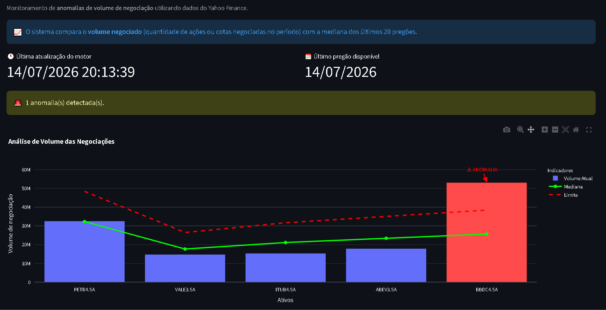

# 📊 Sentinel — Real-Time Anomaly Detection Engine

> **Python engine for statistical anomaly detection using historical moving median analysis.**

<p align="center">
  
</p>

Sentinel é um motor de análise estatística desenvolvido para identificar anomalias operacionais em tempo real através da comparação entre a volumetria atual e o comportamento histórico equivalente.

Ao contrário de sistemas baseados em limites fixos (*static thresholds*), o Sentinel utiliza uma abordagem adaptativa baseada em **Mediana Histórica Móvel** e **Median Absolute Deviation (MAD)**, reduzindo falsos positivos e tornando a detecção de incidentes muito mais confiável.

---

# 🎯 Objetivo

Detectar automaticamente desvios operacionais em qualquer série temporal.

Exemplos de aplicação:

- Chamados de Service Desk
- Tickets
- Eventos
- Logs
- Reclamações
- Transações
- Alertas
- Eventos industriais
- Telemetria

---

# 🚀 Principais Recursos

- ✔ Detecção estatística de anomalias
- ✔ Mediana histórica móvel
- ✔ Cálculo utilizando MAD (Median Absolute Deviation)
- ✔ Arquitetura desacoplada
- ✔ Dashboard em tempo real
- ✔ Notificações por SMTP
- ✔ Integração via Webhooks
- ✔ Processamento assíncrono
- ✔ Baixo consumo de recursos
- ✔ Adaptável para qualquer fonte de dados

---

# 🏗 Arquitetura

```text
          Fonte de Dados
                │
                ▼
        Anomaly Engine
                │
                ▼
    Histórico Estatístico
                │
                ▼
     Detecção de Anomalias
          │             │
          ▼             ▼
     Dashboard     Notificações
```

Toda a lógica de processamento permanece isolada da interface gráfica, facilitando manutenção, testes e futuras integrações.

---

# 📂 Estrutura do Projeto

```text
Sentinel/
│
├── config/
│   └── config_motor.json
│
├── data/
│   └── .gitkeep
│
├── src/
│   ├── anomaly_engine.py
│   ├── dashboard_anomalias.py
│   └── data/
│       └── log_sistema.txt
│
├── README.md
├── Requirements.txt
└── .gitignore
```

---

# ⚙ Tecnologias

- Python 3.9+
- Pandas
- NumPy
- Streamlit
- Plotly
- Requests
- SMTP
- JSON

---

# 📈 Como Funciona

O Sentinel executa continuamente as seguintes etapas:

1. Coleta os dados da fonte monitorada.
2. Agrupa os registros por janelas de tempo equivalentes.
3. Calcula a mediana histórica.
4. Calcula o **Median Absolute Deviation (MAD)**.
5. Compara a volumetria atual com o histórico.
6. Calcula o desvio estatístico.
7. Classifica automaticamente o estado operacional.
8. Atualiza o dashboard em tempo real.
9. Dispara notificações quando uma anomalia é identificada.

Essa abordagem reduz significativamente os falsos positivos quando comparada a sistemas baseados em limites estáticos.

---

# 🚀 Como Executar

## Pré-requisitos

- Python 3.9+
- Ambiente virtual (recomendado)

## Instalação

Clone o repositório:

```bash
git clone https://github.com/SergioLuiz-SLN/Sentinel.git
```

Acesse a pasta do projeto:

```bash
cd Sentinel
```

Instale as dependências:

```bash
pip install -r Requirements.txt
```

---

# ▶ Executando o Motor

```bash
python src/anomaly_engine.py
```

---

# 📊 Executando o Dashboard

```bash

python -m streamlit run src/dashboard_anomalias.py

```

Após a inicialização, o Streamlit exibirá um endereço semelhante a:

```
http://localhost:8501
```

Abra esse endereço em seu navegador para visualizar o dashboard.

---

# ⚙ Configuração

As configurações do motor podem ser alteradas através do arquivo:

```text
config/config_motor.json
```

Nesse arquivo podem ser configurados parâmetros como:

- Intervalo de coleta
- Sensibilidade estatística
- Configuração SMTP
- Webhooks
- Fonte de dados
- Atualização do dashboard

---

# 📈 Algoritmo Estatístico

O Sentinel utiliza uma abordagem robusta baseada em estatística para detectar comportamentos anormais.

Em vez da média tradicional, utiliza:

- **Mediana Histórica**
- **Median Absolute Deviation (MAD)**

Essa abordagem oferece maior estabilidade em ambientes reais, pois reduz a influência de valores extremos (*outliers*) e adapta automaticamente o comportamento esperado de acordo com o histórico operacional.

Benefícios:

- Menor número de falsos positivos
- Melhor adaptação a diferentes cargas de trabalho
- Maior precisão na identificação de incidentes
- Melhor desempenho em séries temporais assimétricas

---

# 💼 Casos de Uso

O Sentinel pode ser aplicado em diversos cenários:

- Service Desk
- Monitoramento de APIs
- NOC (Network Operations Center)
- SOC (Security Operations Center)
- Monitoramento de Infraestrutura
- Operações Industriais
- Telecom
- Instituições Financeiras
- Logística
- Saúde
- Atendimento ao Cliente

---

# 📊 Dashboard

O dashboard foi desenvolvido utilizando:

- Streamlit
- Plotly

Apresentando indicadores em tempo real como:

- Volume atual
- Mediana histórica
- Desvio estatístico
- Estado operacional
- Evolução temporal

Foi projetado para operação contínua em ambientes NOC e SOC.

---

# 🔮 Roadmap

- [ ] API REST
- [ ] Docker
- [ ] Banco PostgreSQL
- [ ] Prometheus Exporter
- [ ] Integração com Grafana
- [ ] Machine Learning para ajuste automático de baseline
- [ ] Processamento paralelo
- [ ] Interface Web de configuração
- [ ] Múltiplas fontes de dados

---

# 🤝 Contribuições

Contribuições são bem-vindas.

Caso encontre bugs, tenha sugestões de melhorias ou deseje contribuir com novas funcionalidades, fique à vontade para abrir uma **Issue** ou enviar um **Pull Request**.

---


# 👨‍💻 Autor

**Sergio Luiz da Silva Nunes**

Senior IT Support Analyst • Python Developer • Automation • Monitoring • Data Analysis

---

> **Sentinel foi desenvolvido como um motor estatístico genérico para detecção de anomalias em séries temporais, permitindo sua aplicação em diferentes domínios operacionais sem dependência de regras fixas ou limites estáticos.**
